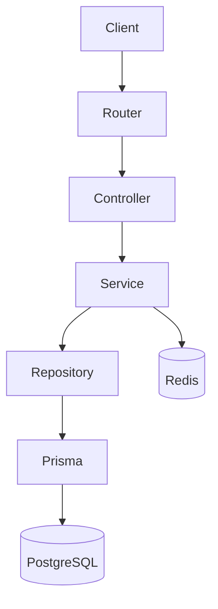
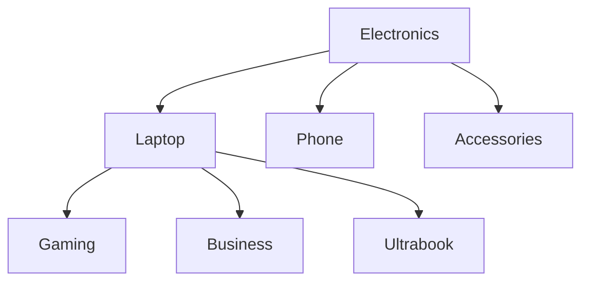
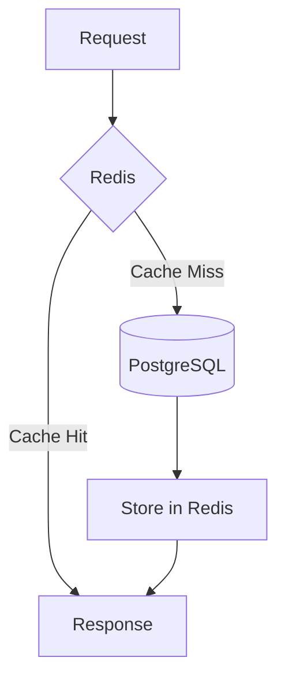

# RacoAI Backend Assessment

<p align="center">


</p>

> **A production-oriented E-commerce REST API built with Node.js, Express.js, TypeScript, Prisma ORM, PostgreSQL and Redis.**

Developed as part of the **RacoAI Backend Engineer Assessment**, this project demonstrates scalable backend architecture, authentication, role-based authorization, Redis caching, hierarchical product categories, and **Depth-First Search (DFS)** based category filtering.

---

# Table of Contents

* [Overview](#overview)
* [Features](#features)
* [Technology Stack](#technology-stack)
* [Architecture](#architecture)
* [Project Structure](#project-structure)
* [Category Hierarchy](#category-hierarchy)
* [DFS Category Filtering](#dfs-category-filtering)
* [Redis Cache Flow](#redis-cache-flow)
* [API Overview](#api-overview)
* [Getting Started](#getting-started)
* [Environment Variables](#environment-variables)
* [Scripts](#scripts)
* [Documentation](#documentation)
* [Design Patterns](#design-patterns)
* [Future Improvements](#future-improvements)

---

# Overview

The application follows a layered architecture that separates responsibilities across dedicated components.

* **Controllers** handle HTTP requests and responses.
* **Services** implement business logic.
* **Repositories** manage database operations.
* **Redis** provides high-performance caching.
* **PostgreSQL** stores persistent application data.

The project focuses on maintainability, scalability, and clean architecture principles.

---

# Features

## Authentication

* JWT Authentication
* Access Token & Refresh Token
* HTTP-only Cookie Authentication
* Password Hashing with bcrypt
* Role-Based Access Control (RBAC)

---

## Product Management

* Create Products
* Update Products
* Delete Products
* Bulk Delete
* Product Details
* SKU Generation
* Pagination
* Search
* Sorting
* Filtering

---

## Category Management

* CRUD Categories
* Self-referencing Category Hierarchy
* Unlimited Nesting
* Parent / Child Relationships
* Category Tree Endpoint

---

## Hierarchical Product Filtering

Products can belong to any category within the hierarchy.

Selecting a parent category automatically includes products from all descendant categories using **Depth-First Search (DFS)**.

Example:

```text
Electronics
│
├── Laptop
│   ├── Gaming Laptop
│   ├── Business Laptop
│   └── Ultrabook
│
├── Phone
│
└── Accessories
```

Filtering by **Laptop** returns products from:

* Laptop
* Gaming Laptop
* Business Laptop
* Ultrabook

without requiring additional requests from the client.

---

## Redis Caching

Frequently accessed resources are cached using Redis.

Cached resources include:

* Product Lists
* Product Details
* Category Tree

The project follows the **Cache-Aside Pattern** to minimize database load.

---

# Technology Stack

| Technology | Purpose             |
| ---------- | ------------------- |
| Node.js    | Runtime             |
| Express.js | REST API            |
| TypeScript | Type Safety         |
| PostgreSQL | Relational Database |
| Prisma ORM | Database Access     |
| Redis      | Distributed Cache   |
| JWT        | Authentication      |
| bcrypt     | Password Hashing    |

---

# Architecture



Each layer has a single responsibility, making the application easier to maintain and extend.

---

# Project Structure

```text
src/
│
├── controllers/
├── services/
├── repositories/
├── routes/
├── middlewares/
├── prisma/
├── generated/
├── types/
├── utils/
└── server.ts
```

---

# Category Hierarchy

Categories are implemented using a self-referencing relationship.



This enables unlimited category nesting while keeping the schema simple.

---

# DFS Category Filtering

```mermaid
flowchart LR

A[GET /products?category=laptop]

A --> B[Build Category Tree]

B --> C[Depth First Search]

C --> D[Collect Descendant IDs]

D --> E[Repository]

E --> F[WHERE categoryId IN (...)]
```

Instead of querying only a single category, the backend expands the selected category into its complete subtree before executing the database query.

---

# Redis Cache Flow



---

# API Overview

## Authentication

```http
POST   /auth/register
POST   /auth/login
POST   /auth/logout
POST   /auth/refresh
```

---

## Products

```http
GET    /products
GET    /products/:id

POST   /products
PATCH  /products/:id

DELETE /products/:id
DELETE /products
```

---

## Categories

```http
GET    /categories
GET    /categories/tree
GET    /categories/:id

POST   /categories
PATCH  /categories/:id
DELETE /categories/:id
```

---

# Getting Started

Clone the repository.

```bash
git clone https://github.com/<your-username>/racoai-backend-assessment.git
```

Install dependencies.

```bash
npm install
```

Generate the Prisma Client.

```bash
npx prisma generate
```

Run database migrations.

```bash
npx prisma migrate dev
```

Seed the database.

```bash
npm run seed
```

Start the development server.

```bash
npm run dev
```

---

# Environment Variables

Create a `.env` file.

```env
DATABASE_URL=

JWT_SECRET=
JWT_REFRESH_SECRET=

REDIS_URL=

PORT=5000

NODE_ENV=development
```

---

# Scripts

| Command            | Description              |
| ------------------ | ------------------------ |
| npm run dev        | Start development server |
| npm run build      | Compile TypeScript       |
| npm start          | Start production build   |
| npm run seed       | Seed database            |
| prisma migrate dev | Run migrations           |
| prisma generate    | Generate Prisma Client   |

---

# Documentation

Additional project documentation:

* **ARCHITECTURE.md**
* **DATABASE.md**
* **API.md**
* **CACHE.md**
* **DFS.md**

---

# Design Patterns

* Layered Architecture
* Repository Pattern
* Service Pattern
* Dependency Injection
* DTO Pattern
* Cache-Aside Pattern

---

# Future Improvements

* Docker
* CI/CD Pipeline
* Swagger / OpenAPI
* Unit Testing
* Integration Testing
* Rate Limiting
* Background Workers
* Event-Driven Architecture
* Elasticsearch

---

# License

This project was developed as part of the **RacoAI Backend Engineer Assessment**.
